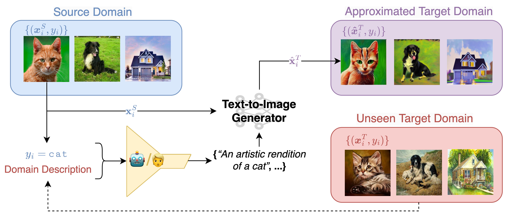
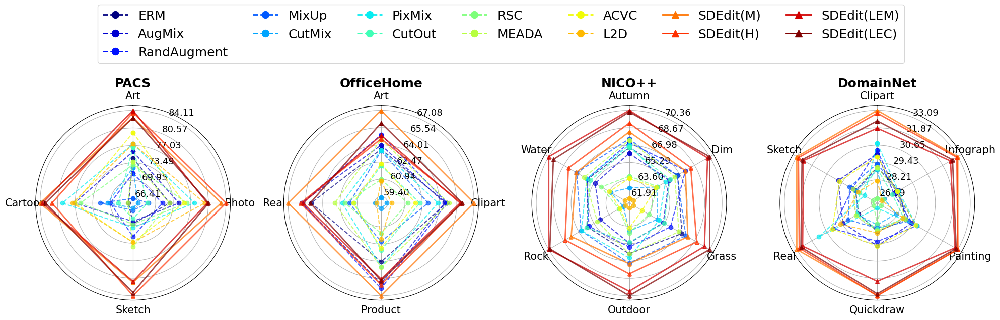
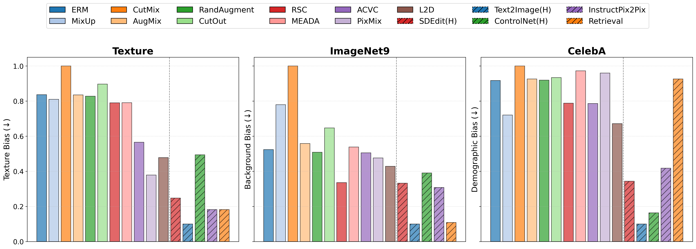
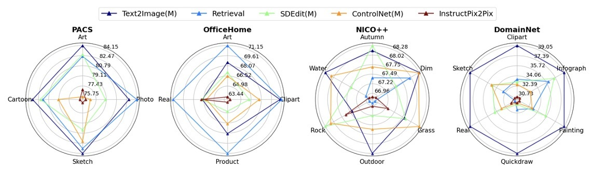

## Abstract

Neural image classifiers are known to undergo severe performance degradation when exposed to inputs that exhibit covariate shifts with respect to the training distribution. A general interventional data augmentation (IDA) mechanism that simulates arbitrary interventions over spurious variables has often been conjectured as a theoretical solution to this problem and approximated to varying degrees of success. In this work, we study how well modern Text-to-Image (T2I) generators and associated image editing techniques can solve the problem of IDA. We experiment across a diverse collection of benchmarks in domain generalization, ablating across key dimensions of T2I generation, including interventional prompts, conditioning mechanisms, and post-hoc filtering, showing that it substantially outperforms previously state-of-the-art image augmentation techniques independently of how each dimension is configured. We discuss the comparative advantages of using T2I for image editing versus synthesis, also finding that a simple retrieval baseline presents a surprisingly effective alternative, which raises interesting questions about how generative models should be evaluated in the context of domain generalization.

## Motivation + Problem Setting
<div style="text-align: left"> Text-to-Image (T2I) generators enable flexible, simple, and powerful Interventional Data Augmentation (IDA)</div>
<div style="text-align: left">- T2I-enabled image editing/synthesis simulates interventional data</div>
<div style="text-align: left">- Train downstream classifiers on real + synthetic data</div>

### Test Cases

<div style="text-align: left">- Single Domain generalization (SDG) -- e.g., train on paintings → test on cartoons or real-world photos</div>
<div style="text-align: left">- Reducing Reliance on Spurious Features (RRSF) -- e.g., correct over-reliance on background, lighting, demographics, etc.</div>


## Approach

<table>
  <tr>
    <td>  </td>   
  </tr>
</table>

<div style="text-align: left">Use T2I models to (1) edit, or (2) synthesize images</div>
<div style="text-align: left">- Causality: intervene on environmental features, preserve causal ones</div>
<div style="text-align: left">Which generative techniques yield best performance for SDG + RRSF?</div>
<div style="text-align: left">- Prompting Strategy (Minimal Template · Handcrafted · LLM-Generated)</div>
<div style="text-align: left">- Conditioning Strategy (SDEdit · ControlNet · InstructPix2Pix · Retrieval)</div>
<div style="text-align: left">- Post-hoc Filtering (different filtering threshold)</div>

## Experiments

### Single Domain generalization (SDG) 

<table>
  <tr>
    <td>  </td>   
  </tr>
</table>

<div style="text-align: left">T2I-based IDA outperforms all traditional data augmentation methods on all SDG benchmarks for all prompting strategies</div>
<div style="text-align: left">- However, prompting strategy still matters: minimal templatic prompts (M) perform well; diverse, handcrafted prompts (H) perform even better</div>

### Reducing Reliance on Spurious Features (RRSF)

<table>
    <tr>
    <td>  </td>   
  </tr>
</table>

<div style="text-align: left">T2I data augmentation also outperforms all traditional data augmentation methods for RRSF (lower ↓ is better).</div>
<div style="text-align: left">- Conditioning mechanism plays most significant role</div>
<div style="text-align: left">- Text2Image (condition only on text, not images) is best for RRSF.</div>
<div style="text-align: left">- Measured over several kinds of bias/spurious correlations, including: Texture (CCS) · Background (ImageNet9) · Demographics (CelebA)</div>

### Conditioning Mechanism

<table>
  <tr>
    <td>  </td>   
  </tr>
</table>

<div style="text-align: left">Conditioning mechanism is most important factor</div>
<div style="text-align: left">- Text2Image: generally most stable/competitive</div>
<div style="text-align: left">- No universal “best option” – all others outperform it for at least one benchmark/domain</div>
<div style="text-align: left">Upshot: conditioning should be carefully selected depending on target domain/application</div>

### Post-hoc Filtering

<table>
  <tr>
    <td>  </td>   
  </tr>
</table>

<div style="text-align: left">Post-hoc filtering has trivial effect (in contrast to prior work)</div>
<div style="text-align: left">- Upshot: current T2I (SD1.4) is good enough without filtering – at least for current SDG + RRSF benchmarks</div>
<div style="text-align: left">- Instead, recommend focusing on (1) conditioning and (2) prompting</div>

## Citation

```
@inproceedings{
yuan2024not,
title={Not Just Pretty Pictures: Toward Interventional Data Augmentation Using Text-to-Image Generators},
author={Jianhao Yuan and Francesco Pinto and Adam Davies and Philip Torr},
booktitle={Forty-first International Conference on Machine Learning},
year={2024},
url={https://openreview.net/forum?id=b89JtZj9gm}
}
```
