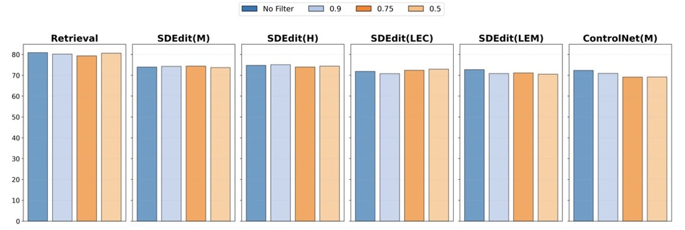

## Abstract

Neural image classifiers are known to undergo severe performance degradation when exposed to inputs that exhibit covariate shifts with respect to the training distribution. A general interventional data augmentation (IDA) mechanism that simulates arbitrary interventions over spurious variables has often been conjectured as a theoretical solution to this problem and approximated to varying degrees of success. In this work, we study how well modern Text-to-Image (T2I) generators and associated image editing techniques can solve the problem of IDA. We experiment across a diverse collection of benchmarks in domain generalization, ablating across key dimensions of T2I generation, including interventional prompts, conditioning mechanisms, and post-hoc filtering, showing that it substantially outperforms previously state-of-the-art image augmentation techniques independently of how each dimension is configured. We discuss the comparative advantages of using T2I for image editing versus synthesis, also finding that a simple retrieval baseline presents a surprisingly effective alternative, which raises interesting questions about how generative models should be evaluated in the context of domain generalization.

## Motivation + Problem Setting
Text-to-Image (T2I) generators enable flexible, simple, and powerful Interventional Data Augmentation (IDA)
- T2I-enabled image editing/synthesis simulates interventional data
- Train downstream classifiers on real + synthetic data

### Test Cases

- Single Domain generalization (SDG) 
  - E.g., train on paintings → test on cartoons or real-world photos!
- Reducing Reliance on Spurious Features (RRSF)
  - E.g., correct over-reliance on background, lighting, demographic features


## Approach

<table>
  <tr>
    <td>  </td>   
  </tr>
</table>

Use T2I models to (1) edit, or (2) synthesize images
- Causality: intervene on environmental features, preserve causal ones
Which generative techniques yield best performance for SDG + RRSF?
- Prompting Strategy
  - Minimal Template · Handcrafted · LLM-Generated 
- Conditioning Strategy
  - SDEdit · ControlNet · InstructPix2Pix · Retrieval
- Post-hoc Filtering

## Experiments

### Single Domain generalization (SDG) 

<table>
  <tr>
    <td>  </td>   
  </tr>
</table>

- T2I-based IDA outperforms all traditional data augmentation methods on all SDG benchmarks for all prompting strategies
- However, prompting strategy still matters:
  - Minimal prompts (M; e.g., “A photo of [class name] in style of [style name]”) perform well
  - Diverse, handcrafted prompts (H) perform even better

### Reducing Reliance on Spurious Features (RRSF)

<table>
    <tr>
    <td>  </td>   
  </tr>
</table>

- T2I data augmentation also outperforms all traditional data augmentation methods for RRSF (lower ↓ is better).
  - Conditioning mechanism plays most significant role
  - Text2Image (condition only on text, not images) is best for RRSF.
- Measured over several kinds of bias/spurious correlations, including:
  - Texture (CCS) · Background (ImageNet9) · Demographics (CelebA)

### Conditioning Mechanism

<table>
  <tr>
    <td>  </td>   
  </tr>
</table>

- Conditioning mechanism is most important factor
  - Text2Image: generally most stable/competitive
  - No universal “best option” – all others outperform it for at least one benchmark/domain
- Upshot: conditioning should be carefully selected depending on target domain/application

### Post-hoc Filtering

<table>
  <tr>
    <td>  </td>   
  </tr>
</table>

- Post-hoc filtering has trivial effect (in contrast to prior work)
  - Upshot: current T2I (SD1.4) is good enough without filtering – at least for current SDG + RRSF benchmarks
  - Instead, recommend focusing on (1) conditioning and (2) prompting

## Citation

```
@inproceedings{
yuan2024not,
title={Not Just Pretty Pictures: Toward Interventional Data Augmentation Using Text-to-Image Generators},
author={Jianhao Yuan and Francesco Pinto and Adam Davies and Philip Torr},
booktitle={Forty-first International Conference on Machine Learning},
year={2024},
url={https://openreview.net/forum?id=b89JtZj9gm}
}
```
