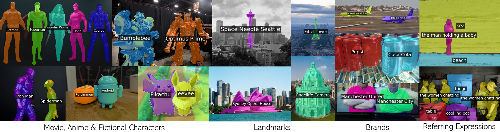
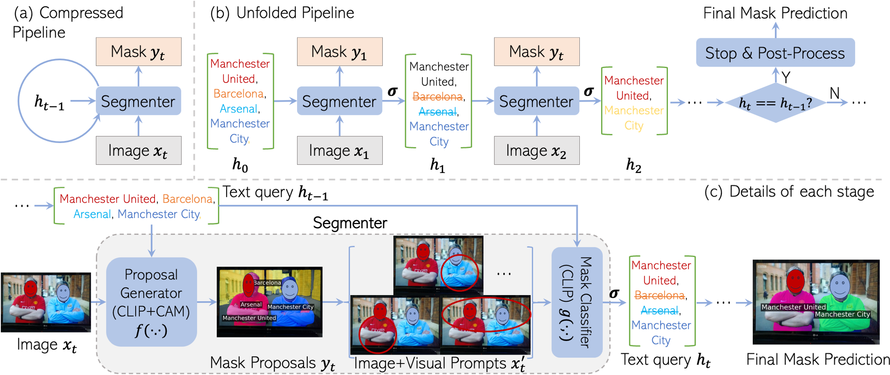

## TL;DR
We proposed a framework that can segment countless visual concepts without any training endeavour. 
Our method outperforms not only the training-free counterparts, but also those fine-tuned with millions of additional data samples, and sets new state-of-the-art records for both zero-shot semantic and referring image segmentation tasks.

 

## Abstract

Existing open-vocabulary image segmentation methods require a fine-tuning step on mask annotations and/or image-text datasets. Mask labels are labor-intensive, which limits the number of categories in segmentation datasets. As a result, the open-vocabulary capacity of pre-trained VLMs is severely reduced after fine-tuning. However, without fine-tuning, VLMs trained under weak image-text supervision tend to make suboptimal mask predictions when there are text queries referring to non-existing concepts in the image.
To alleviate these issues, we introduce a novel recurrent framework that progressively filters out irrelevant texts and enhances mask quality without training efforts. The recurrent unit is a two-stage segmenter built upon a VLM with frozen weights. Thus, our model retains the VLM's broad vocabulary space and strengthens its segmentation capability.
Experimental results show that our method outperforms not only the training-free counterparts, but also those fine-tuned with millions of additional data samples, and sets new state-of-the-art records for both zero-shot semantic and referring image segmentation tasks. Specifically, we improve the current record by 28.8, 16.0, and 6.9 mIoU on Pascal VOC, COCO Object, and Pascal Context. Code and a web-demo will be available for reproduction.

## Method

 


## Citation

```
@misc{clip_as_rnn,
      title={CLIP as RNN: Segment Countless Visual Concepts without Training Endeavor}, 
      author={Shuyang Sun and Runjia Li and Philip Torr and Xiuye Gu and Siyang Li},
      year={2023},
      eprint={2312.07661},
      archivePrefix={arXiv},
      primaryClass={cs.CV}
}
```
