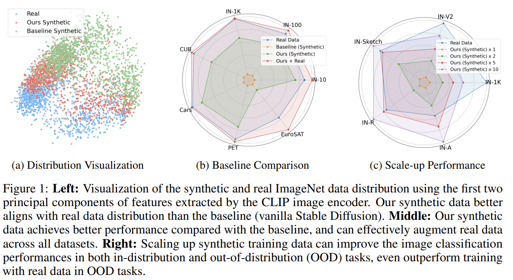
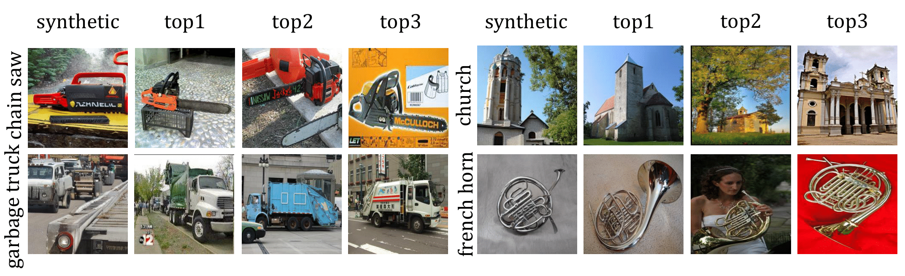

## Demos
<table>
  <tr>
    <td>  </td>   
  </tr>
  <tr>
    <td>  </td>   
  </tr>
</table>


## Abstract

Synthetic training data has gained prominence in numerous learning tasks and scenarios, offering advantages such as dataset augmentation, generalization evaluation, and privacy preservation. Despite these benefits, the efficiency of synthetic data generated by current methodologies remains inferior when training advanced deep models exclusively, limiting its practical utility. To address this challenge, we analyze the principles underlying training data synthesis for supervised learning and elucidate a principled theoretical framework from the distribution-matching perspective that explicates the mechanisms governing synthesis efficacy. Through extensive experiments, we demonstrate the effectiveness of our synthetic data across diverse image classification tasks, both as a replacement for and augmentation to real datasets, while also benefits challenging tasks such as out-of-distribution generalization and privacy preservation.

## Citation

```
@article{yuan2023real,
  title={Real-Fake: Effective Training Data Synthesis Through Distribution Matching},
  author={Yuan, Jianhao and Zhang, Jie and Sun, Shuyang and Torr, Philip and Zhao, Bo},
  journal={arXiv preprint arXiv:2310.10402},
  year={2023}
}
```
